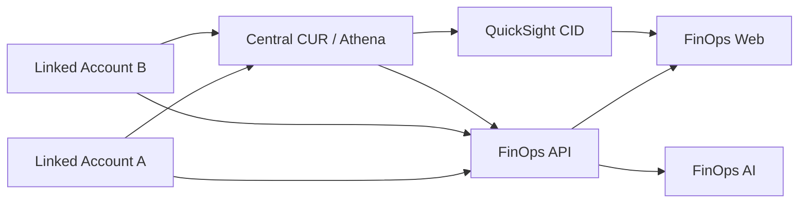

# FinOPS-AWS-China

面向 AWS 中国区的多账号 FinOps 参考实现。项目把 CUR、Athena、Cost Explorer、Compute Optimizer、CloudWatch、Cost Anomaly Detection、QuickSight CID 和 FinOps AI 聚合到统一的只读 Web/API 中。

本仓库不包含真实账号 ID、Bucket、主机地址、用户、凭据或客户数据。示例中的 `Linked Account A`、`Linked Account B` 和 `<...>` 均为占位符。

## 四阶段路线图

| 阶段 | 目标 | 主要交付 |
|---|---|---|
| Phase 1 | 数据整合 | 双账号 CUR、中央 S3、Glue/Athena、QuickSight |
| Phase 2 | API 聚合 | CE/CO/CW/异常/定价 API、COH-lite 建议中心 |
| Phase 3 | FinOps AI | 成本问答、差异解释、异常调查、建议解读 |
| Phase 4 | 持续运行 | 日/周/月运行、任务闭环、节省验证和报告 |



## 仓库结构

```text
app/                       FastAPI 后端和静态前端
deploy/                    Dockerfile 与 Docker Compose
docs/                      Phase 1–4、部署和安全说明
infra/cloudformation/      AWS 中国区参数化基础设施模板
infra/sql/                 Athena 统一视图和 Dashboard 示例 SQL
scripts/                   CUR、密钥和部署脚本
tests/                     端到端 Smoke Test
.github/workflows/         CI 与秘密信息扫描
```

## 快速开始

1. 按 [Phase 1](docs/phase-1-data-foundation.md) 建立双账号 CUR 和中央 Athena。
2. 按 [Phase 2](docs/phase-2-api-coh-lite.md) 部署跨账号只读角色。
3. 将 `.env.example` 复制为 `.env`，替换所有占位符。
4. 在宿主机运行 `sudo bash scripts/bootstrap-secrets.sh`，通过标准输入提供 DeepSeek API Key。
5. 启动应用：

```bash
docker compose --env-file .env -f deploy/docker-compose.yml up -d --build
```

服务默认只绑定 `127.0.0.1:8080`。可使用 SSM 端口转发或 SSH 隧道访问 `http://localhost:8080`。

完整顺序见 [实施计划](docs/implementation-plan.md) 和 [部署手册](docs/deployment.md)。

## 安全边界

- AWS 访问使用 EC2 Instance Profile 和 STS 临时凭据，不保存长期 AK/SK。
- DeepSeek Key、会话密钥和密码哈希使用 Docker secrets。
- API 和 UI 对账号与资源标识做伪匿名化。
- AWS 权限为只读；代码不包含关机、删除、缩容或购买 RI/SP 的执行接口。
- QuickSight 默认采用 Registered User 嵌入；匿名嵌入需要另购会话容量并配置 RLS。

## 验证

```bash
python -m compileall -q app
docker compose --env-file .env -f deploy/docker-compose.yml config
sudo python3 tests/smoke-test.py
```

部署前请执行秘密信息扫描，并人工复核所有 CloudFormation 参数和 IAM 权限。
