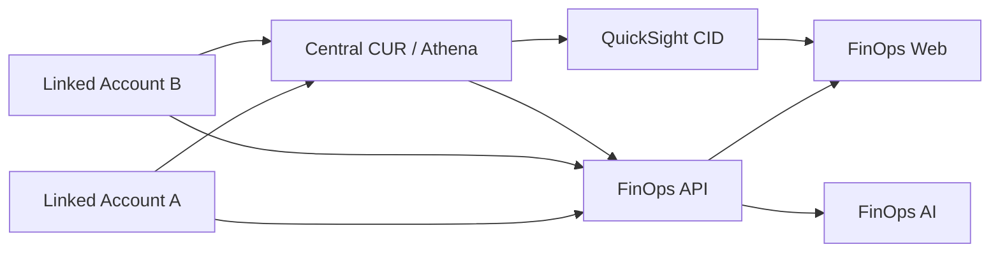

# FinOPS-AWS-China

面向 AWS 中国区的多账号 FinOps 参考实现。项目把 CUR、Athena、Cost Explorer、Compute Optimizer、CloudWatch、Cost Anomaly Detection、QuickSight CID 和 FinOps AI 聚合到统一的只读 Web/API 中。

本仓库不包含真实账号 ID、Bucket、主机地址、用户、凭据或客户数据。示例中的 `Linked Account A`、`Linked Account B` 和 `<...>` 均为占位符。

## 从这里开始

客户部署请从以下文档进入：

1. **主入口：[客户部署手册](docs/deployment.md)**

   包含账号准备、部署顺序、每条命令、CloudFormation Outputs、CUR/Athena/CID 衔接、Docker 启动和验收。

2. **方案与检查点：[四阶段实施计划](docs/implementation-plan.md)**

   用于确认 Phase 1–4 的范围、输入、输出和阶段验收门。

3. **专项说明：**
   - [Phase 1：CUR、Athena 与 QuickSight](docs/phase-1-data-foundation.md)
   - [Phase 2：API 聚合与 COH-lite](docs/phase-2-api-coh-lite.md)
   - [Phase 3：FinOps AI](docs/phase-3-finops-ai.md)
   - [Phase 4：持续运行](docs/phase-4-operations.md)
   - [安全设计](docs/security.md)

不要跳过主部署手册直接运行单个 YAML；Stack Outputs 需要按手册传给后续 Stack、Athena、QuickSight 和应用配置。

## 四阶段路线图

| 阶段 | 目标 | 主要交付 |
|---|---|---|
| Phase 1 | 数据整合 | 双账号 CUR、中央 S3、Glue/Athena、QuickSight |
| Phase 2 | API 聚合 | CE/CO/CW/异常/定价 API、COH-lite 建议中心 |
| Phase 3 | FinOps AI | 成本问答、差异解释、异常调查、建议解读 |
| Phase 4 | 持续运行 | 日/周/月运行、任务闭环、节省验证和报告 |



## 仓库结构

```text
app/                       FastAPI 后端和静态前端
deploy/                    Dockerfile 与 Docker Compose
docs/                      Phase 1–4、部署和安全说明
infra/cloudformation/      AWS 中国区参数化基础设施模板
infra/sql/                 Athena 统一视图和 Dashboard 示例 SQL
scripts/                   CUR、密钥和部署脚本
tests/                     端到端 Smoke Test
.github/workflows/         CI 与秘密信息扫描
```

## 部署顺序速览

| 步骤 | 在哪里执行 | 结果 |
|---:|---|---|
| 1 | Account A / 北京 | 中央 S3、Glue Database、Athena Workgroup |
| 2 | Account A / 宁夏 | Account A CUR Bucket 和复制规则 |
| 3 | Account B / 宁夏 | Account B CUR Bucket 和跨账号复制规则 |
| 4 | 两个账号 | 创建 Hourly Parquet CUR，等待首次交付 |
| 5 | Account A / 北京 | 创建两张 Athena 原始表和统一视图 |
| 6 | Account B → Account A | 部署成员 Read Role、Collector Role 和 Instance Profile |
| 7 | Account A / 北京 | 部署 QuickSight CID并取得 Dashboard ID/User ARN |
| 8 | PoC Container Host | 配置 `.env`、Secrets、构建并启动 Docker |
| 9 | PoC Container Host + 浏览器 | 执行 Smoke Test 和人工验收 |

CloudFormation 不会自动创建 CUR Definition、Athena 原始表，也不会自动替换既有 EC2 Instance Profile。具体命令和注意事项全部在[客户部署手册](docs/deployment.md)中。

服务默认只绑定 `127.0.0.1:8080`，通过 SSM 或 SSH 隧道访问。

## 安全边界

- AWS 访问使用 EC2 Instance Profile 和 STS 临时凭据，不保存长期 AK/SK。
- DeepSeek Key、会话密钥和密码哈希使用 Docker secrets。
- API 和 UI 对账号与资源标识做伪匿名化。
- AWS 权限为只读；代码不包含关机、删除、缩容或购买 RI/SP 的执行接口。
- QuickSight 默认采用 Registered User 嵌入；匿名嵌入需要另购会话容量并配置 RLS。

## 验证

```bash
python -m compileall -q app
docker compose --env-file .env -f deploy/docker-compose.yml config
sudo python3 tests/smoke-test.py
```

部署前请执行秘密信息扫描，并人工复核所有 CloudFormation 参数和 IAM 权限。
