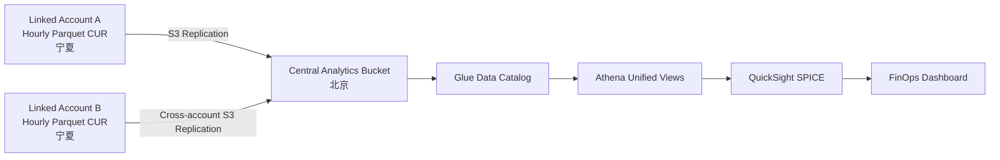

# AWS 中国区 FinOps Phase 1 — CUR 汇聚与 QuickSight 实施参考

**文档类型：** 客户实施参考

**适用区域：** AWS 中国（宁夏）`cn-northwest-1`、AWS 中国（北京）`cn-north-1`
**数据源：** `Linked Account A`、`Linked Account B`

## 1. 实施目标

Phase 1 将两个 AWS 中国区账号的成本与使用情况报告（CUR）汇聚到统一数据层，并通过 Athena 和 QuickSight 提供成本分析看板。

交付结果包括：

- 两个账号分别生成 Hourly Parquet CUR。
- CUR 数据自动汇聚到中央分析 Bucket。
- Glue/Athena 提供统一成本数据模型。
- 对外仅显示 `Linked Account A` 和 `Linked Account B`，不展示真实账号标识。
- QuickSight 使用统一 Athena 数据和 SPICE 缓存。
- Dashboard 展示总成本、月度趋势、账号对比和服务成本分布。
- 每日自动刷新，并可按需手动刷新。

## 2. 总体架构



### 区域设计

- CUR 在宁夏区生成并写入各自账号拥有的 S3 Bucket。
- 中央分析 Bucket、Glue、Athena 和 QuickSight 部署在北京区。
- 使用 S3 Cross-Region Replication 将 CUR 从宁夏复制到北京。
- 两个源账号独立交付；一个账号暂时失败时，不影响另一个账号的数据处理。

## 3. 命名和变量

以下示例使用变量，不包含任何真实账号或内部资源信息：

| 变量 | 说明 | 示例逻辑值 |
|---|---|---|
| `${ACCOUNT_A_ID}` | 中央分析账号 | Linked Account A 所属账号 |
| `${ACCOUNT_B_ID}` | 第二个源账号 | Linked Account B 所属账号 |
| `${CUR_BUCKET_A}` | A 的 CUR 源 Bucket | `customer-cur-account-a-<unique>` |
| `${CUR_BUCKET_B}` | B 的 CUR 源 Bucket | `customer-cur-account-b-<unique>` |
| `${CENTRAL_BUCKET}` | 北京中央分析 Bucket | `customer-finops-central-<unique>` |
| `${CUR_REPORT_A}` | A 的 CUR 名称 | `finops-cur-account-a` |
| `${CUR_REPORT_B}` | B 的 CUR 名称 | `finops-cur-account-b` |
| `${REPLICATION_ROLE_B}` | B 的复制角色 | `FinOpsCURReplicationRole` |

## 4. 步骤一：配置两个账号的 CUR

两个账号使用完全一致的 CUR 口径：

| 配置项 | 建议值 |
|---|---|
| Time granularity | `HOURLY` |
| Format | `Parquet` |
| Compression | `Parquet` |
| Report versioning | `OVERWRITE_REPORT` |
| Additional artifact | `ATHENA` |
| Include resource IDs | 启用 |
| Split Cost Allocation Data | 启用 |
| Refresh closed reports | 启用 |
| Source Region | `cn-northwest-1` |

### 4.1 创建 CUR 源 Bucket

在每个源账号的宁夏区创建独立 Bucket：

- Linked Account A：`${CUR_BUCKET_A}`
- Linked Account B：`${CUR_BUCKET_B}`

两边均启用：

- S3 Versioning
- S3 默认加密 SSE-S3 或客户指定的 SSE-KMS
- Block Public Access 四项全部启用

### 4.2 配置 CUR Bucket Policy

每个源 Bucket 都需要允许 AWS Billing Reports 服务检查 Bucket 并写入 CUR。以下以 Linked Account B 为例：

```json
{
  "Version": "2012-10-17",
  "Statement": [
    {
      "Sid": "AllowCURBucketRead",
      "Effect": "Allow",
      "Principal": {
        "Service": "billingreports.amazonaws.com"
      },
      "Action": [
        "s3:GetBucketAcl",
        "s3:GetBucketPolicy"
      ],
      "Resource": "arn:aws-cn:s3:::${CUR_BUCKET_B}",
      "Condition": {
        "StringLike": {
          "aws:SourceArn": "arn:aws-cn:cur:cn-northwest-1:${ACCOUNT_B_ID}:definition/*"
        },
        "StringEquals": {
          "aws:SourceAccount": "${ACCOUNT_B_ID}"
        }
      }
    },
    {
      "Sid": "AllowCURObjectWrite",
      "Effect": "Allow",
      "Principal": {
        "Service": "billingreports.amazonaws.com"
      },
      "Action": "s3:PutObject",
      "Resource": "arn:aws-cn:s3:::${CUR_BUCKET_B}/*",
      "Condition": {
        "StringLike": {
          "aws:SourceArn": "arn:aws-cn:cur:cn-northwest-1:${ACCOUNT_B_ID}:definition/*"
        },
        "StringEquals": {
          "aws:SourceAccount": "${ACCOUNT_B_ID}"
        }
      }
    }
  ]
}
```

Linked Account A 使用相同结构，将变量替换为 A 的账号和 Bucket。

### 4.3 创建 CUR 定义

示例 AWS CLI：

```bash
aws cur put-report-definition \
  --region cn-northwest-1 \
  --report-definition '{
    "ReportName":"'${CUR_REPORT_B}'",
    "TimeUnit":"HOURLY",
    "Format":"Parquet",
    "Compression":"Parquet",
    "AdditionalSchemaElements":["RESOURCES","SPLIT_COST_ALLOCATION_DATA"],
    "S3Bucket":"'${CUR_BUCKET_B}'",
    "S3Prefix":"cur",
    "S3Region":"cn-northwest-1",
    "AdditionalArtifacts":["ATHENA"],
    "RefreshClosedReports":true,
    "ReportVersioning":"OVERWRITE_REPORT"
  }'
```

验证：

```bash
aws cur describe-report-definitions \
  --region cn-northwest-1 \
  --query 'ReportDefinitions[].{Name:ReportName,Status:ReportStatus,Bucket:S3Bucket}'
```

首次交付完成的判断标准：

- `lastStatus` 为 `SUCCESS`
- `lastDelivery` 非空
- Bucket 中出现 Manifest、建表 SQL和 Parquet 文件

## 5. 步骤二：配置 S3 自动汇聚

### 5.1 创建北京中央分析 Bucket

在中央账号的北京区创建 `${CENTRAL_BUCKET}`，并启用：

- Versioning
- 默认加密
- Block Public Access
- Athena 查询结果前缀，例如 `athena-results/`

建议为两个源定义独立路径：

```text
<Account A CUR original prefix>/...
<Account B CUR original prefix>/...
athena-results/...
```

S3 Live Replication 会保留源对象 Key。账号别名在 Athena 视图中增加，不依赖真实账号 ID 或 S3 路径暴露给 Dashboard。

### 5.2 创建源端 Replication Role

角色信任关系：

```json
{
  "Version": "2012-10-17",
  "Statement": [
    {
      "Effect": "Allow",
      "Principal": {
        "Service": "s3.amazonaws.com"
      },
      "Action": "sts:AssumeRole"
    }
  ]
}
```

Linked Account B 的复制权限示例：

```json
{
  "Version": "2012-10-17",
  "Statement": [
    {
      "Effect": "Allow",
      "Action": [
        "s3:GetReplicationConfiguration",
        "s3:ListBucket"
      ],
      "Resource": "arn:aws-cn:s3:::${CUR_BUCKET_B}"
    },
    {
      "Effect": "Allow",
      "Action": [
        "s3:GetObjectVersionForReplication",
        "s3:GetObjectVersionAcl",
        "s3:GetObjectVersionTagging"
      ],
      "Resource": "arn:aws-cn:s3:::${CUR_BUCKET_B}/cur/${CUR_REPORT_B}/*"
    },
    {
      "Effect": "Allow",
      "Action": [
        "s3:ReplicateObject",
        "s3:ReplicateDelete",
        "s3:ReplicateTags",
        "s3:ObjectOwnerOverrideToBucketOwner"
      ],
      "Resource": "arn:aws-cn:s3:::${CENTRAL_BUCKET}/cur/${CUR_REPORT_B}/*"
    }
  ]
}
```

Linked Account A 到同账号中央 Bucket 的复制角色使用相同结构；同账号场景不需要 `ObjectOwnerOverrideToBucketOwner`。

### 5.3 配置中央 Bucket 跨账号授权

中央 Bucket 只授权 Linked Account B 的复制角色写入 B 的专属前缀：

```json
{
  "Version": "2012-10-17",
  "Statement": [
    {
      "Sid": "AllowSourceReplicationBucketChecks",
      "Effect": "Allow",
      "Principal": {
        "AWS": "arn:aws-cn:iam::${ACCOUNT_B_ID}:role/${REPLICATION_ROLE_B}"
      },
      "Action": [
        "s3:GetBucketVersioning",
        "s3:PutBucketVersioning"
      ],
      "Resource": "arn:aws-cn:s3:::${CENTRAL_BUCKET}"
    },
    {
      "Sid": "AllowSourceReplicationObjects",
      "Effect": "Allow",
      "Principal": {
        "AWS": "arn:aws-cn:iam::${ACCOUNT_B_ID}:role/${REPLICATION_ROLE_B}"
      },
      "Action": [
        "s3:ReplicateObject",
        "s3:ReplicateDelete",
        "s3:ReplicateTags",
        "s3:ObjectOwnerOverrideToBucketOwner"
      ],
      "Resource": "arn:aws-cn:s3:::${CENTRAL_BUCKET}/cur/${CUR_REPORT_B}/*"
    }
  ]
}
```

该策略不授予 Linked Account B 读取 Linked Account A CUR 或 Athena 查询结果的权限。

### 5.4 创建 Replication Rule

跨账号规则关键参数：

```json
{
  "Role": "arn:aws-cn:iam::${ACCOUNT_B_ID}:role/${REPLICATION_ROLE_B}",
  "Rules": [
    {
      "ID": "FinOpsCURToCentralBeijing",
      "Priority": 1,
      "Status": "Enabled",
      "Filter": {
        "Prefix": "cur/${CUR_REPORT_B}/"
      },
      "DeleteMarkerReplication": {
        "Status": "Disabled"
      },
      "Destination": {
        "Account": "${ACCOUNT_A_ID}",
        "Bucket": "arn:aws-cn:s3:::${CENTRAL_BUCKET}",
        "StorageClass": "STANDARD",
        "AccessControlTranslation": {
          "Owner": "Destination"
        }
      }
    }
  ]
}
```

验证源对象：

```bash
aws s3api head-object \
  --bucket ${CUR_BUCKET_B} \
  --key <cur-object-key> \
  --query ReplicationStatus
```

预期为 `COMPLETED`。目标端同一对象的状态应为 `REPLICA`。

### 5.5 处理复制规则创建前的历史对象

Live Replication 只自动处理规则启用后的新增或更新对象。已有历史 CUR 可使用：

- S3 Batch Replication；或
- PoC 阶段一次性 `aws s3 sync`。

```bash
aws s3 sync \
  s3://${CUR_BUCKET_A}/<cur-prefix>/ \
  s3://${CENTRAL_BUCKET}/<cur-prefix>/ \
  --source-region cn-northwest-1 \
  --region cn-north-1 \
  --no-progress
```

命令不使用 `--delete`，避免删除目标端对象。

## 6. 步骤三：建立 Glue/Athena 统一模型

### 6.1 创建 Database 和 Workgroup

```sql
CREATE DATABASE IF NOT EXISTS finops_cur;
```

Athena Workgroup 建议配置：

- 查询结果：`s3://${CENTRAL_BUCKET}/athena-results/`
- Enforce workgroup configuration：启用
- CloudWatch metrics：启用
- 设置合理的单次查询扫描上限
- 使用 Athena engine version 3

### 6.2 创建两张原始 CUR 表

CUR 会为每个账期生成 `*-create-table.sql`。复制到北京后：

1. 下载生成的 SQL。
2. 将 Database/Table 名分别改为：
   - `finops_cur.cur_linked_account_a_raw`
   - `finops_cur.cur_linked_account_b_raw`
3. 将 `LOCATION` 改为北京中央 Bucket 中对应 Parquet 路径。
4. 执行 DDL。

示例 Location：

```sql
LOCATION 's3://${CENTRAL_BUCKET}/<account-a-cur-prefix>/<report-name>/'
```

两个账号必须采用一致的 CUR 配置，确保表结构可以统一。

### 6.3 启用分区投影

分区投影使新账期文件到达后无需手动执行 `MSCK REPAIR TABLE`：

```sql
ALTER TABLE finops_cur.cur_linked_account_a_raw
SET TBLPROPERTIES (
  'projection.enabled'='true',
  'projection.year.type'='integer',
  'projection.year.range'='2025,2035',
  'projection.month.type'='integer',
  'projection.month.range'='1,12',
  'storage.location.template'=
    's3://${CENTRAL_BUCKET}/<account-a-parquet-prefix>/year=${year}/month=${month}/'
);
```

为 B 表执行相同配置，并替换为 B 的 Parquet 路径。

### 6.4 创建统一账号别名视图

```sql
CREATE OR REPLACE VIEW finops_cur.cur_unified AS
SELECT
  'Linked Account A' AS linked_account,
  *
FROM finops_cur.cur_linked_account_a_raw

UNION ALL

SELECT
  'Linked Account B' AS linked_account,
  *
FROM finops_cur.cur_linked_account_b_raw;
```

原始表仅供受控的数据工程角色使用。QuickSight 不直接使用原始表，而是使用下一节的聚合视图，避免向客户展示真实账号字段和资源标识。

## 7. QuickSight SQL 到 Dashboard 完整示例

本例构建一个“每日成本视图”，再将其导入 SPICE 并制作 Dashboard。

### 7.1 创建 Dashboard 专用聚合视图

```sql
CREATE OR REPLACE VIEW finops_cur.v_dashboard_cost_daily AS
SELECT
  CAST(line_item_usage_start_date AS DATE) AS usage_date,
  DATE_TRUNC('month', line_item_usage_start_date) AS usage_month,
  linked_account,
  COALESCE(
    NULLIF(product_product_name, ''),
    NULLIF(line_item_product_code, ''),
    'Unknown Service'
  ) AS service,
  COALESCE(
    NULLIF(product_region, ''),
    NULLIF(product_region_code, ''),
    'Global'
  ) AS region,
  line_item_currency_code AS currency,
  line_item_line_item_type AS charge_type,
  SUM(line_item_unblended_cost) AS unblended_cost,
  SUM(line_item_usage_amount) AS usage_quantity,
  COUNT(*) AS line_item_count
FROM finops_cur.cur_unified
WHERE line_item_usage_start_date >= DATE_ADD('month', -13, CURRENT_DATE)
GROUP BY 1, 2, 3, 4, 5, 6, 7;
```

该视图只输出 Dashboard 所需的聚合字段，不输出：

- 真实账号 ID
- Payer Account ID
- Resource ID
- S3 Bucket 名称
- 用户名或凭据

### 7.2 在 Athena 验证 SQL

```sql
SELECT
  linked_account,
  usage_month,
  currency,
  ROUND(SUM(unblended_cost), 2) AS monthly_cost
FROM finops_cur.v_dashboard_cost_daily
GROUP BY 1, 2, 3
ORDER BY usage_month, linked_account;
```

预期：

- 同时出现 `Linked Account A` 和 `Linked Account B`
- 每个账号按月份和币种返回成本
- 未出现真实账号字段

### 7.3 创建 QuickSight Athena Data Source

1. 登录组织的 IAM Identity Center 访问门户。
2. 打开北京区 QuickSight。
3. 进入 **Datasets → New dataset → Athena**。
4. 选择中央 Athena Workgroup。
5. 确认 QuickSight 服务角色具备：
   - Athena 查询权限
   - Glue Catalog 读取权限
   - 中央 Bucket 数据读取权限
   - Athena 查询结果路径读写权限

建议 Data Source 名称：`FinOps Central Athena`。

### 7.4 创建 SPICE Data Set

选择 **Use custom SQL**，输入：

```sql
SELECT
  usage_date,
  usage_month,
  linked_account,
  service,
  region,
  currency,
  charge_type,
  unblended_cost,
  usage_quantity,
  line_item_count
FROM finops_cur.v_dashboard_cost_daily;
```

建议设置：

- Data Set 名称：`FinOps Unified Cost`
- Import mode：`SPICE`
- Refresh：每天北京时间 02:30 Full Refresh
- 导入失败时保留上一个成功快照

### 7.5 创建 Analysis

在 Analysis 中配置以下 Visual：

#### Visual 1：总成本 KPI

- Visual type：KPI
- Value：`SUM(unblended_cost)`
- Title：`Total Unblended Cost`
- Currency：使用 `currency` 过滤器控制

#### Visual 2：月度成本趋势

- Visual type：Line chart
- X axis：`usage_month`
- Value：`SUM(unblended_cost)`
- Color：`linked_account`
- Title：`Monthly Cost Trend by Linked Account`

#### Visual 3：服务成本 Top 20

- Visual type：Horizontal bar chart
- Category：`service`
- Value：`SUM(unblended_cost)`
- Color：`linked_account`
- Sort：成本降序
- Limit：Top 20
- Title：`Cost by Service and Linked Account`

#### Visual 4：账号/区域成本明细

- Visual type：Table
- Group by：`linked_account`, `service`, `region`
- Value：`SUM(unblended_cost)`, `SUM(usage_quantity)`
- Title：`Cost Detail by Account, Service and Region`

### 7.6 添加 Dashboard Filters

建议添加：

- Date：默认最近 6 个月
- Linked Account：多选
- Service：多选和搜索
- Region：多选
- Currency：单选
- Charge Type：多选

### 7.7 发布 Dashboard

1. 在 Analysis 中选择 **Publish**。
2. Dashboard 名称：`FinOps Cost Overview`。
3. 分享给客户授权的 QuickSight Group。
4. Reader 只获得 Dashboard 查看权限，不获得原始 CUR 表权限。

Dashboard 和 SPICE 使用同一聚合视图，保证 SQL、Analysis 和最终展示采用一致口径。

### 7.8 部署 AWS 官方 Cost Intelligence Dashboard（CID）

在自定义 Dashboard 之外，可按 AWS 中国区官方指南部署 Cost Intelligence Dashboard：

1. Region 选择北京区 `cn-north-1`。
2. 数据收集账号中复用中央 Athena Database、Workgroup 和客户脱敏 CUR View。
3. CloudFormation 参数设置：
   - `DeployCostIntelligenceDashboard = yes`
   - `DeployCUDOSv5 = no`
   - `DeployKPIDashboard = no`
   - `CURVersion = 1.0`
   - `CreateLocalAssetsBucket = yes`
   - `CurrencySymbol = ¥`
4. QuickSight User 选择有发布权限的 Admin/Author。
5. 部署完成后验证 `summary_view`、`s3_view`、`ec2_running_cost` 和 `compute_savings_plan_eligible_spend` 四个 SPICE 数据集。
6. 将账号映射固定为 `Linked Account A`、`Linked Account B`，payer 显示为 `Payer Account`。
7. 对四个数据集执行一次 Full Refresh，要求全部 `COMPLETED` 且 `RowsDropped = 0`。

CID 入口格式：

```text
https://cn-north-1.quicksight.amazonaws.cn/sn/dashboards/<cid-dashboard-id>
```

CID 用于客户日常成本分析，自定义 SQL Dashboard 用于演示指定 KPI；两者读取同一中央数据口径。

客户部署模板：[`phase1-cid-deployment.yaml`](../infra/cloudformation/phase1-cid-deployment.yaml)。部署父栈时需要确认 `CAPABILITY_NAMED_IAM` 和 `CAPABILITY_AUTO_EXPAND`，模板会调用 AWS 官方 CID 模板并创建所需的 IAM、Lambda、Athena 和 QuickSight 资源。

## 8. 刷新和运行机制

每日流程：

1. AWS Billing 更新两个账号的 CUR。
2. S3 Replication 将新增/更新对象复制到北京中央 Bucket。
3. Athena 分区投影自动识别账期数据。
4. QuickSight 按计划刷新 SPICE。
5. Dashboard 使用最新成功快照。

需要立即更新时，可以手动触发：

```bash
aws quicksight create-ingestion \
  --region cn-north-1 \
  --aws-account-id ${ACCOUNT_A_ID} \
  --data-set-id <dataset-id> \
  --ingestion-id manual-$(date +%Y%m%d%H%M%S) \
  --ingestion-type FULL_REFRESH
```

验证 ingestion：

```bash
aws quicksight describe-ingestion \
  --region cn-north-1 \
  --aws-account-id ${ACCOUNT_A_ID} \
  --data-set-id <dataset-id> \
  --ingestion-id <ingestion-id>
```

验收要求：

- `IngestionStatus = COMPLETED`
- `RowsDropped = 0`
- 行数与 Athena 聚合结果一致

## 9. 数据质量与验收

### 9.1 CUR 交付

- 两个 CUR 的 `lastStatus` 均为 `SUCCESS`
- 两个源 Bucket 均有当前账期 Manifest 和 Parquet
- 中央 Bucket 中存在对应副本

### 9.2 复制链路

- 源对象 `ReplicationStatus = COMPLETED`
- 目标对象 `ReplicationStatus = REPLICA`
- 一个源账号失败时，另一个账号仍可查询

### 9.3 Athena

```sql
SELECT
  linked_account,
  COUNT(*) AS line_items,
  ROUND(SUM(line_item_unblended_cost), 2) AS total_cost
FROM finops_cur.cur_unified
GROUP BY 1
ORDER BY 1;
```

验收：同时返回 `Linked Account A` 和 `Linked Account B`。

### 9.4 QuickSight

- Athena Data Source 状态正常
- SPICE ingestion 完成且 0 行丢弃
- Analysis 和 Dashboard 已发布
- Dashboard 只显示账号别名
- Dashboard 总成本与 Athena SQL 一致

### 9.5 CUR 与 Cost Explorer 对账

建议使用相同时间范围、币种和成本口径进行对账：

- CUR：`SUM(line_item_unblended_cost)`
- Cost Explorer：UnblendedCost
- 明确是否包含 Tax、Credit、Refund、Support 和 Marketplace
- 对账差异应不超过 1%；所有差异需说明来源

## 10. 权限边界

- 源账号只允许 AWS CUR 服务写自己的 CUR Bucket。
- Replication Role 只读取指定 CUR 前缀。
- Linked Account B 只写中央 Bucket 的 B 专属前缀。
- QuickSight 只访问中央聚合数据和 Athena 结果。
- Dashboard 数据集不包含真实账号、资源 ID、用户名或凭据。
- 客户 Reader 不访问原始 CUR 表。

## 11. AWS 官方参考

- [Creating Cost and Usage Reports](https://docs.amazonaws.cn/en_us/cur/latest/userguide/cur-create.html)
- [Setting up an S3 bucket for CUR](https://docs.amazonaws.cn/en_us/cur/latest/userguide/cur-s3.html)
- [CUR and consolidated billing](https://docs.amazonaws.cn/en_us/cur/latest/userguide/cur-consolidated-billing.html)
- [S3 replication setup](https://docs.amazonaws.cn/en_us/AmazonS3/latest/userguide/replication-how-setup.html)
- [S3 replication within and across Regions](https://docs.amazonaws.cn/en_us/AmazonS3/latest/userguide/replication.html)
- [S3 Batch Replication for existing objects](https://docs.amazonaws.cn/en_us/AmazonS3/latest/userguide/s3-batch-replication-batch.html)
- [Querying CUR using Athena](https://docs.amazonaws.cn/en_us/cur/latest/userguide/cur-query-athena.html)
- [QuickSight in AWS China](https://docs.amazonaws.cn/aws/latest/userguide/quicksight.html)
- [QuickSight with IAM Identity Center](https://docs.amazonaws.cn/quicksight/latest/user/sec-identity-management-identity-center.html)
- [AWS 中国区 Cloud Intelligence Dashboards 部署指南](https://docs.aws.amazon.com/zh_cn/guidance/latest/cloud-intelligence-dashboards/deployment-in-china.html)
