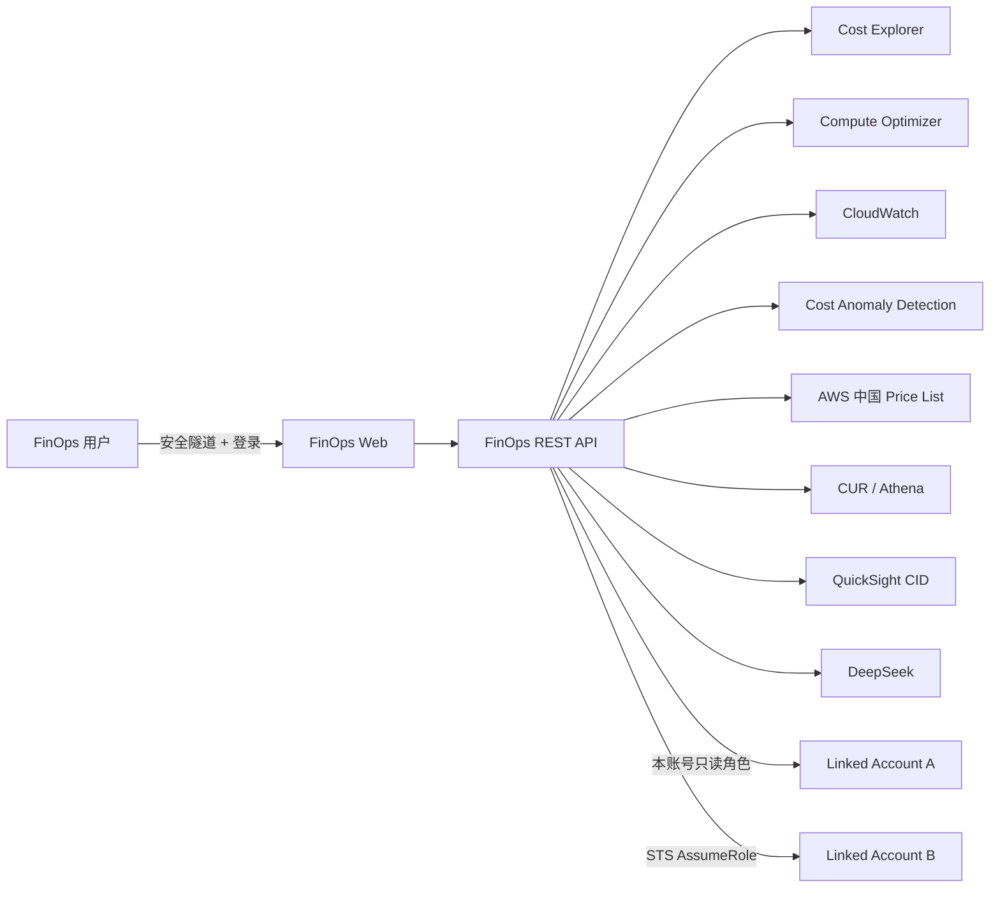

# AWS 中国区 FinOps API 与 AI 应用实施参考

## 1. 实施目标

本方案在 Phase 1 统一成本数据基础上，提供一个客户可访问的 FinOps Web 应用和 REST API。应用统一读取 Linked Account A 与 Linked Account B 的成本、异常、资源利用率及优化建议，并把 AWS 官方 Cost Intelligence Dashboard（CID）和 FinOps AI 集成到同一个入口。

应用只执行查询和分析，不自动停止、缩容、删除资源或购买 RI/Savings Plans。

## 2. 总体架构

应用以独立 Docker Compose project 运行在 `PoC Container Host`。服务仅绑定宿主机本地地址，通过 SSH 或 SSM 隧道访问。

## 3. AWS 权限配置

### 3.1 Linked Account A

为 `PoC Container Host` 关联一个最小权限 Instance Profile，允许读取：

- Cost Explorer 与 Cost Anomaly Detection
- Compute Optimizer
- EC2、EBS、EIP、ELB、NAT Gateway、RDS/Aurora 资源清单
- CloudWatch 指标
- 中国区 Price List
- 中央 CUR 的 Athena 查询结果
- QuickSight CID Registered User 嵌入会话
- STS AssumeRole 到 Linked Account B

### 3.2 Linked Account B

在 Linked Account B 创建只读跨账号角色，Trust Policy 仅信任 Linked Account A 的 Collector Role。角色包含 CE、Compute Optimizer、CloudWatch 及资源清单读取权限。

应用通过 Instance Profile 和 STS 临时凭据访问 AWS，不在容器内保存长期 AK/SK。

## 4. 数据源设计

| 客户需求 | 主要数据源 | 补充数据源 |
|---|---|---|
| 成本汇总、趋势和分摊 | Cost Explorer | CUR/Athena |
| 成本预测 | Cost Explorer Forecast | CUR 趋势 |
| 公开价格 | AWS 中国 Price List | CUR 实际账单 |
| 成本异常 | Cost Anomaly Detection | CUR 日成本 |
| EC2/EBS/ECS/Lambda 等建议 | Compute Optimizer | CUR 实际成本 |
| 空闲资源 | 资源清单 + CloudWatch | CUR 实际成本 |
| RDS/Aurora 建议 | RDS API + CloudWatch | CUR + 中国区价格 |
| 账单核对 | CUR/Athena | Cost Explorer |

每个 API 响应包含数据源、时间范围、采集时间和账号状态。一个账号查询失败时，另一个账号仍正常返回，整体状态显示为 `PARTIAL`。

## 5. Web 应用功能

### FinOps 总览

- 当月成本及 Linked Account A/B 分布
- 近 30 天成本趋势
- AWS 托管建议和自定义规则摘要

### 成本分析

- 自定义日期范围
- 按服务、账号、区域等维度分组
- Cost Explorer 与 CUR 金额对账

### 优化建议

- Compute Optimizer 汇总、EC2 和 EBS 建议
- 空闲 EC2、未挂载 EBS、未关联 EIP、低活跃 ELB/NAT 候选
- RDS Idle、Downsize、Provisioned IOPS 复核候选
- Aurora Cluster 和 Reader 活跃度规则
- 建议证据、阈值、指标覆盖率、实际月成本和最大节省金额

### 异常检测

- 按账号列出 Cost Anomaly Detection 结果
- 展示异常影响金额、影响比例和时间范围
- 未配置异常监控器时明确显示 `NOT_CONFIGURED`

### CID Dashboard

Web 应用通过后端创建有时限的 QuickSight Registered User 会话，在同一页面安全嵌入官方 CID。CID 与 Web 应用使用相同的中央 CUR 数据链和账号别名。

### FinOps AI

- 成本问答和趋势解释
- 异常调查和根因线索
- 空闲资源、RDS/Aurora 和 Compute Optimizer 建议解读
- 模型选择、Temperature、最大输出 Token 和连接测试

AI 数值回答来自后端工具结果。模型只接收与问题相关的聚合数据和伪匿名资源标识，不接收原始 CUR、真实账号标识或任何凭据。

## 6. 规则示例

### 空闲 EC2

1. 查询指定观察期内 CPU、网络和状态指标。
2. 检查指标覆盖率，覆盖不足不生成确定性建议。
3. 满足低利用条件时输出 `IDLE_CANDIDATE`。
4. 从 CUR 汇总该资源最近 30 天实际成本。
5. 返回停止/排程复核建议、风险、指标证据和最大节省金额。

### RDS Downsize

1. 读取实例类型、引擎、存储和高可用配置。
2. 聚合 CPU、DatabaseConnections、Read/Write IOPS 与吞吐。
3. 满足低利用阈值时输出 `DOWNSIZE_CANDIDATE`。
4. 在目标规格和价格确认前，不把全部当前成本声明为可节省金额。

### Aurora Reader

按 Cluster 识别 Writer 与 Reader，结合连接数和负载检查低活跃 Reader。建议中同时提示故障转移和可用性评估，不依据单一指标直接删除 Reader。

## 7. 安全访问与认证

- 应用使用独立登录账号和 HttpOnly、SameSite 会话 Cookie。
- 容器端口只绑定 `127.0.0.1`，通过 SSH/SSM 隧道访问。
- QuickSight 使用 Registered User 嵌入，不启用匿名公开分享。
- DeepSeek API Key 仅以 Docker Secret 提供给后端，前端只能看到“已配置”。
- 账号 ID 在客户界面统一显示为 `Linked Account A` 和 `Linked Account B`。
- 资源 ID 使用稳定伪匿名标识，便于跟踪同一资源且不暴露真实 ID。
- API、AI 和 CID 均为只读分析路径。

## 8. 客户验收步骤

1. 登录 FinOps Web，确认页面只显示 Linked Account A/B。
2. 在“成本分析”选择一个完整账期，确认 CE 与 CUR 对账结果。
3. 在“优化建议”分别打开 CO、Idle、RDS 和 Aurora 页签，查看来源、证据和成本。
4. 在“异常检测”确认异常或 `NOT_CONFIGURED` 状态表达正确。
5. 在“CID Dashboard”打开 CID，确认 Billing Summary、Cost、Compute、Storage 和 RI/SP 页面可用。
6. 在“FinOps AI”询问一个带时间范围的成本问题，确认回答包含工具数据来源。
7. 在“模型配置”测试连接，确认只显示 Key 已配置状态而不显示 Key。
8. 模拟一个账号采集失败，确认另一个账号仍返回且整体状态为 `PARTIAL`。

## 9. 验收结果示例

- 两账号 CE 成本、趋势和分组查询通过。
- Compute Optimizer、异常和 Price List 查询通过。
- Idle 与 RDS 建议均可关联 CUR 实际月成本。
- CE/CUR 对账通过。
- CID 已在 Web 中真实渲染。
- DeepSeek 连接与真实 FinOps 回答通过。
- 浏览器测试无 Console Error 或 Page Error。
- 页面、HTML 和 API 响应未发现账号 ID、AK/SK 或模型 API Key。
